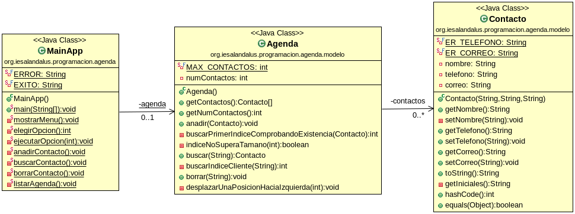

# Tarea Agenda
## Profesor: Andrés Rubio del Río
## Alumno:

La tarea va a consistir en gestionar una agenda de nuestros contactos. He subido a GitHub un esqueleto de proyecto gradle que ya lleva incluidos todos los test necesarios que el programa debe pasar. Dichos test están todos comentados y deberás ir descomentándolos conforme vayas avanzando con la tarea. La URL del repositorios es en la que te encuentras.

Para ello te pongo un diagrama de clases para el mismo y poco a poco te iré explicando los diferentes pasos a realizar:

1. Lo primero que debes hacer es hacer un **fork** del repositorio donde he colocado un proyecto gradle con la estructura del proyecto y todos los test necesarios.
2. Clona tu repositorio remoto recién copiado en github a un repositorio local que será donde irás realizando lo que a continuación se te pide.
3. Crea la clase `Contacto` con sus atributos correspondientes. Haz un commit.
4. Crea los métodos `get` y `set`. Ten en cuenta que el nombre no puede estar vacío y que además no podemos modificar el nombre de un contacto ya creado, el teléfono debe empezar por 6 o 9 y tener 9 dígitos en total y que el correo debe ser un correo válido. Si no se cumple el método `set` correspondiente deberá lanzar una excepción del tipo `IllegalArgumentException` con el mensaje adecuado. Utiliza dos atributos de clase que no se puedan modificar para guardar las expresiones regulares a validar.  Haz un commit.
5. Crea el constructor con los parámetros adecuados y que haga el mismo control que en el caso anterior. Haz un commit.
6. Crea los demás métodos que se muestran en el diagrama de clases, teniendo en cuenta que el método `toString` nos devolverá una cadena con las iniciales del nombre y encerrado entre corchetes el teléfono y el correo separados por comas. También debes tener en cuenta que un contacto será igual que otro si sus nombres, ignorando mayúsculas y minúsculas, son iguales. Haz un commit.
7. Crea la clase `Agenda` con los atributos que se especifican. Haz un commit.
8. Crea el constructor y los métodos `get` que se especifican. El método `getContactos` devolverá una copia del array de contactos. Haz un commit.
9. Crea el método `anadir` para añadir un contacto a la agenda de forma que ésta se quede ordenada por orden de inserción y sin que admita contactos repetidos. Apóyate en los métodos privados `buscarPrimerIndiceComprobandoExistencia` e `IndiceNoSuperaTamano`. El método debe informar de todos los posibles errores mediante la excepcion `OperationNotSupportedException`: ya existe ese contacto, el array está lleno, etc. Haz un commit.
10. Crea el método `buscar` que recibirá el nombre del contacto y devolverá el contacto. Apóyate en el método privado `buscarIndiceCliente`. Haz un commit.
11. Crea el método `borrar` que borrará un contacto de la lista dejando la misma compactada (los contactos válidos al principio y los nulos al final). Apóyate en el método `desplazarUnaPosicionHaciaIzquierda`. El método debe informar de los posibles errores mediante la excepcion `OperationNotSupportedException`. Haz un commit.
12. Crea los diferentes métodos que se indican en el diagrama de clases para permitir que el método main nos muestre un menú que nos permitirá añadir un contacto, buscar un contacto, borrar un contacto, listar todos los contactos no nulos y salir. El menú se repetirá mientras no elijamos la opción salir. En todo caso se debe informar al usuario del resultado de la operación y de los posibles errores. Haz un commit y súbelo todo a tu repositorio de github.

##### Se valorará:

- La nomenclatura del repositorio de GitHub.
- La indentación debe ser correcta en cada uno de los apartados.
- El nombre de las variables debe ser adecuado.
- Se debe utilizar la clase Entrada para realizar la entrada por teclado.
- El programa debe pasar todas las pruebas que van en el esqueleto del proyecto y toda entrada del programa será validada, para evitar que el programa termine abruptamente debido a una excepción.
- Se valorará la corrección ortográfica tanto en los comentarios como en los mensajes que se muestren al usuario.
